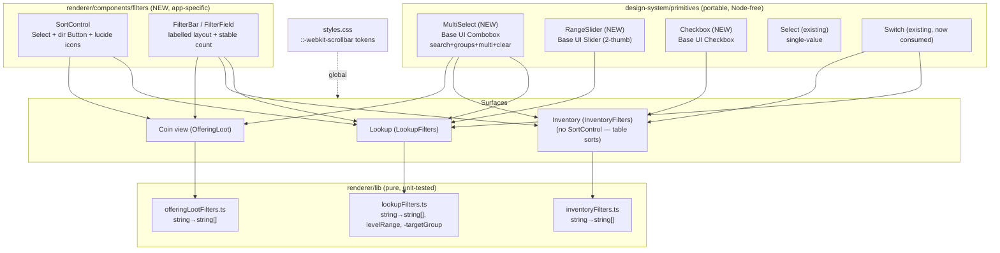

# Filtering & Sorting Evolution — Design

**Spec**: `.specs/features/filtering-sorting-evolution/spec.md`
**Context**: `.specs/features/filtering-sorting-evolution/context.md`
**Status**: Draft

---

## Research findings (Knowledge Verification Chain)

Verified against the installed `@base-ui/react@1.6.0` `.d.ts` files (Step 1/3 — codebase +
pinned package, not memory). **Every capability the spec needs is native to Base UI:**

| Capability | Base UI component | Evidence |
|------------|-------------------|----------|
| Multi-select + checkmarks + groups | `select` (`multiple` prop; `group`/`group-label`/`item-indicator` parts) | `select/root/SelectRoot.d.ts` `multiple?`, `value: SelectValueType<Value, Multiple>` |
| **Searchable** multi-select w/ chips, clear, empty, groups | `combobox` (`input`, `filter`, `multiple`, `chips`/`chip-remove`, `clear`, `empty`, `group`/`group-label`, `item-indicator`) | `combobox/` parts dir; `combobox/root` `multiple?`, `filter?` |
| Two-thumb range slider | `slider` (array value: "For ranged sliders, provide an array with two values") | `slider/root/SliderRoot.d.ts` `value?` |
| Themed checkbox | `checkbox` / `checkbox-group` | `node_modules/@base-ui/react/checkbox/` |

**Decision — Combobox, not "search bolted onto Select":** Base UI's `Select` has no input
part, so adding search would mean hand-rolling filtering/focus/keyboard handling. `Combobox`
ships search (`input` + `filter`), `multiple`, `clear`, `empty`, chips, and groups as first
class parts. The new multi-select primitive is therefore built on **Combobox**, used in a
"select-like" configuration (trigger opens a popup containing the search input + grouped list).
The existing `Select` primitive stays as-is for single-value controls (sort key, currency).

> Diagrams below are inline mermaid. The `mermaid-studio` skill isn't installed — installing
> it would give rendered SVG/validation; mentioning once per the skill guidance.

---

## Architecture Overview

Three new/changed **design-system primitives** (portable, props-only, Base-UI-backed) plus
two **renderer composites** (app-specific), consumed by the three filter surfaces. Pure
filter logic in `lib/` changes from single-string fields to `string[]` / range tuples.



---

## Code Reuse Analysis

### Existing components to leverage

| Component | Location | How to use |
|-----------|----------|------------|
| `Select` | `design-system/primitives/Select/` | Keep for single-value (SortControl's "sort by", Market currency). Reference its trigger/popup cva + layout-stability footer slot when building MultiSelect. |
| `Switch` | `design-system/primitives/Switch/` | Adopt directly for `tradableOnly`/`unequippedOnly`/`uniqueOnly` toggles (currently unused). |
| `Field` | `design-system/primitives/Field/` | Top-label layout already exists (`flex-col` non-checkbox path). Reuse for label-above-control; the `checkbox` layout path is superseded by Switch/Checkbox. |
| `Button` (`variant="icon"`, `size="sm"`) | `design-system/primitives/Button/` | SortControl direction toggle wraps it; swap text `▲▼` for lucide icons. |
| `Popover` | `design-system/primitives/Popover/` | Pattern reference for portal popups; column picker already uses it. |
| cva pattern | `design-system/lib/variants.ts` | One `cva()` per primitive; split variant objects into sibling files (Fast Refresh rule). |
| Option-builder helpers | `lib/lookupFilters.ts`, `inventoryFilters.ts`, `offeringLootFilters.ts` | `*OptionsFrom*` functions are unchanged — they already return option lists; only the *state shape* and *predicate* change. **Exception:** `levelOptionsFromItems` becomes unused (fixed 1–100 bounds, D5) → remove it and its `levelOptions` prop. |

### Integration points

| System | Integration method |
|--------|--------------------|
| Pure filter fns | Change state field types (`string`→`string[]`, min/max→`levelRange`); update predicates to membership/range; **tests travel with the code** (Vitest in `test/...`). |
| Inventory data table | **Untouched** — sorting stays in `InventoryTable` via `toggleSort`; Inventory only gains MultiSelect/Switch/Checkbox/labels/scrollbar. |
| lucide-react | New dep in `app/package.json`; allow-list build script in `pnpm-workspace.yaml` if pnpm skips it (AGENTS.md). Import named icons only. |
| Global CSS | `styles.css` adds `::-webkit-scrollbar*` rules using `@theme` tokens (Electron = Chromium, so webkit pseudo-elements apply everywhere, including existing Base UI popups). |

---

## Components

### MultiSelect (new primitive)

- **Purpose**: Searchable, optionally-grouped, multi-value dropdown with clear and per-option
  checked indicators. The headline primitive (FILT-01/02/04/05).
- **Location**: `design-system/primitives/MultiSelect/`
- **Built on**: `@base-ui/react/combobox` (trigger → popup with `Input` + grouped `List`).
- **Interfaces**:
  - `options: MultiSelectOption[] | MultiSelectGroup[]` where
    `MultiSelectOption = { value: string; label: string }` and
    `MultiSelectGroup = { label: string; options: MultiSelectOption[] }`.
  - `value: string[]` — selected values; **`[]` means "no filter / All"**.
  - `onValueChange(next: string[]): void`
  - `label?: ReactNode` — rendered above the trigger (top-label requirement FILT-13).
  - `searchable?: boolean` (default `true`) — show the in-popup search input + `empty` state.
  - `allLabel?: string` (e.g. "All grades") — trigger summary when `value` is empty.
  - `summarize?(value, options): string` — optional override; default: single label, else
    `"{n} selected"`. Trigger also exposes a clear (✕) affordance when `value.length > 0`.
  - `disabled?`, `className?`, `title?`.
- **Behavior**: empty search hides no groups; non-matching search hides options and
  empty-of-matches groups; `empty` state message when nothing matches; clear empties `value`.
- **Dependencies**: Base UI Combobox, cva, theme tokens.
- **Reuses**: `Select`'s trigger/popup cva styling + the reserved-footer layout-stability pattern.

### RangeSlider (new primitive)

- **Purpose**: Single dual-thumb min–max numeric range control (FILT-06/07).
- **Location**: `design-system/primitives/RangeSlider/`
- **Built on**: `@base-ui/react/slider` with array value `[number, number]`.
- **Interfaces**:
  - `min: number`, `max: number`, `step?: number` (default 1)
  - `value: [number, number]`, `onValueChange(next: [number, number]): void`
  - `label?: ReactNode`, `formatValue?(n): string` (default `Lv {n}`), `disabled?`, `className?`.
  - Renders the current `[lo, hi]` next to the label.
- **Behavior (D5)**: bounds are **fixed** by the consumer (Lookup passes `LEVEL_MIN=1`,
  `LEVEL_MAX=100` — the game level cap), **not** derived from the filtered items. The slider's
  `value` **persists** independently of other filters — it is never reset or clamped when the
  results list changes. When `value` equals `[min, max]` the consumer treats it as "no level
  filter". The primitive itself is range-agnostic; the fixed 1–100 policy lives in the Lookup
  consumer via `LEVEL_MIN`/`LEVEL_MAX` constants.
- **Dependencies**: Base UI Slider, cva, theme tokens.
- **Reuses**: ProgressBar/CapacityBar token palette for the filled track.

### Checkbox (new primitive)

- **Purpose**: Themed standalone checkbox (FILT-11) for the column picker and any remaining
  non-toggle checkbox. (MultiSelect's per-option indicator is internal to that primitive.)
- **Location**: `design-system/primitives/Checkbox/`
- **Built on**: `@base-ui/react/checkbox` with a token-styled box + check `Indicator`.
- **Interfaces**: `checked`, `onCheckedChange(checked: boolean)`, `label?`, `disabled?`,
  `aria-label?`, `className?`.
- **Reuses**: Switch's token-driven styling approach; replaces native `<input type=checkbox>`
  in `InventoryColumnPicker`.

### SortControl (new renderer composite)

- **Purpose**: One grouped sort unit — "Sort by" Select + direction toggle (FILT-08/09).
- **Location**: `renderer/components/filters/SortControl.tsx` (app-specific, **not** a
  primitive — composes primitives and carries sort semantics).
- **Interfaces**:
  - `options: { value: string; label: string }[]`, `sortKey: string`, `onSortKeyChange`
  - `sortDir: "asc" | "desc"`, `onSortDirToggle`
  - `label?` (default "Sort by", top-positioned).
- **Icons**: `lucide-react` `ArrowDownNarrowWide` / `ArrowUpNarrowWide` (or `ArrowUp`/`ArrowDown`)
  replacing text `▲▼`. Direction button reuses `Button variant="icon" size="sm"`.
- **Used by**: Lookup + OfferingLoot only. **Not** Inventory.

### FilterBar / FilterField (new renderer composite, layout)

- **Purpose**: Consistent labelled filter layout with stable wrapping and a fixed-position
  result count (FILT-13/14). Planned with **tbh-ux**.
- **Location**: `renderer/components/filters/FilterBar.tsx`
- **Interfaces**: `children` (filter controls); a dedicated right-aligned/stable `count` slot
  so "{n} shown" no longer rides inside the wrapping flex and gets shoved by other filters.
- **Reuses**: Inventory header order from tbh-ux (TabHeader → controls → list); reserved-space
  layout-stability rule from `docs/STYLING.md`.

### Global scrollbar styling (FILT-12)

- **Location**: `styles.css` — add `::-webkit-scrollbar`, `-thumb`, `-track` rules keyed to
  `--color-border`/`--color-muted`/`--color-panel`. One global source covers tabs, popups,
  `DataList`, and Base UI portals. (No per-component Base UI `ScrollArea` wrapping needed.)

---

## Data Models

State-shape changes (renderer state + pure-fn inputs). `[]`/full-range = "no filter".

```typescript
// lib/lookupFilters.ts
export interface LookupFilterState {
  query: string;
  typeFilter: string[];         // was string ("ALL")
  gradeFilter: string[];        // was string
  gearTypeFilter: string[];     // was string
  classFilter: string[];        // was string
  materialKindFilter: string[]; // was string
  effectFilter: string[];       // was string (now searchable multi)
  // targetGroupFilter: REMOVED (D4 / FILT-15)
  uniqueOnly: boolean;
  levelRange: [number, number];        // replaces minLevel/maxLevel. Fixed bounds
                                       // LEVEL_MIN=1..LEVEL_MAX=100 (D5); default [1,100]
                                       // = no filter. Persists across other filter changes.
  sortKey: LookupSortKey;
  sortDir: "asc" | "desc";
}

// lib/inventoryFilters.ts
export interface InventoryFilterState {
  query: string;
  tradableOnly: boolean;
  unequippedOnly: boolean;
  gradeFilter: string[];        // was string
  typeFilter: string[];         // was string
  locationFilter: LocationFilter[]; // was single LocationFilter
  sortKey: SortKey;             // unchanged (table-driven)
  sortDir: "asc" | "desc";      // unchanged
}

// lib/offeringLootFilters.ts (Coin view)
export interface LootFilterState {
  query: string;
  gradeFilter: string[];        // was string
  typeFilter: string[];         // was string
  sortKey: OfferingLootSortKey;
  sortDir: "asc" | "desc";
}
```

**Predicate semantics (FILT-03):** for each multi field,
`sel.length === 0 || sel.includes(itemValue)` (OR within a filter); distinct filters remain
ANDed. **Level (D5, material-safe):**
`isFullRange(levelRange) || item.level == null || (item.level >= lo && item.level <= hi)`
where `isFullRange = lo === LEVEL_MIN && hi === LEVEL_MAX`. Items without a level (materials)
**always pass** the level check, so a persisted band only narrows gear and never wrongly
hides materials when GEAR + MATERIAL are both selected. Multi-select options are derived from
the same bundled catalog the items come from, so an "all selected" set genuinely covers every
present value (spec edge case) and the static catalog avoids the new-value trap; **Clear** is
the explicit empty reset.

---

## Error / edge handling

| Scenario | Handling | User impact |
|----------|----------|-------------|
| Multi-select empty | Predicate treats as "All"; trigger shows `allLabel` | Sees everything, label reads "All grades" |
| Search matches nothing | Combobox `empty` part renders message | "No matches" line, list empty |
| Level band set, then materials shown | Level predicate is material-safe (level-less items pass); band persists (D5), never cleared | Materials still appear; band intact for when gear returns |
| Type filter excludes GEAR | Gear-only **multi-select** sub-filters (gearType/class) hide; the **level slider state persists** (not cleared). `handleTypeFilterChange` no longer touches `levelRange` | Re-selecting GEAR restores the prior level band |
| GEAR **and** MATERIAL both selected (multi type) | Show both gear-only and material-only sub-filter groups; level band narrows only gear (material-safe predicate) | Both sub-filter sets usable together |
| lucide build script skipped by pnpm | Allow-list in `pnpm-workspace.yaml` `allowBuilds` | Icons resolve in dev/build |

---

## Tech Decisions (non-obvious)

| Decision | Choice | Rationale |
|----------|--------|-----------|
| Searchable multi-select base | Base UI **Combobox**, new `MultiSelect` primitive | Native search/multi/clear/empty/groups; Select has no input part |
| Keep `Select` | Yes, for single-value (sort key, currency) | No reason to churn working single-selects; smaller diff |
| Scrollbar styling | Global `::-webkit-scrollbar` CSS, not Base UI `ScrollArea` | Electron=Chromium; one rule covers everything incl. portals; zero per-component churn |
| SortControl & FilterBar | Renderer composites in `components/filters/`, not primitives | They carry app sort/layout semantics; primitives stay atomic & portable |
| Checkbox primitive | Add it (don't only restyle inline inputs) | `InventoryColumnPicker` has standalone checkboxes; a primitive keeps styling tokenized & testable |
| Level filter shape | `levelRange: [number,number] \| null` | Single source for the dual-thumb slider; null = untouched, avoids two nullable fields |
| "All selected = none" | Membership predicate + catalog-derived options + explicit Clear | Honors edge case without runtime "did they select literally all?" checks |

---

## Open question for Tasks/UX

- **FilterBar exact layout per surface** (grouping, order, wrap breakpoints, where the count
  and SortControl sit) is delegated to the **tbh-ux** pass during Tasks — the design fixes the
  *components and contracts*, tbh-ux fixes the *arrangement*. P3 extra filters (tradable-only
  on Lookup, value/count ranges) are designed-for (RangeSlider/MultiSelect reuse) but opt-in.
