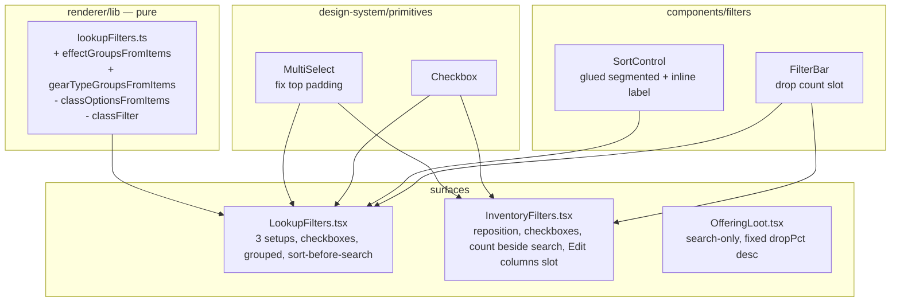

# Design — filtering-sorting-refinements

Builds on context.md decisions. Mostly composition changes over existing
primitives; two new pure helpers (grouping) and one SortControl restyle.

## Architecture (renderer-only)



## Code reuse

- **Checkbox** primitive already supports labelled rows (`label` prop) and bare
  box (`aria-label`). Reuse directly for Item type, Unique only, Tradable only,
  Unequipped only. No primitive change.
- **MultiSelect** already supports grouped options (`MultiSelectGroup[]`). The
  grouping work is purely producing grouped option arrays; only the top-padding
  bug needs a primitive edit.
- **offeringLootFilters.ts** stays general (grade/type still parameters, well
  tested); the Coin view simply passes empty filters + fixed `dropPct`/`desc`.
  Not stripped — avoids deleting tested code for a caller-side simplification.

## New pure helpers (`lookupFilters.ts`)

```ts
export type LookupEffectGroup = { label: string; options: LookupEffectOption[] };

// Offense/Defense/Util/Skill per context.md R1; unmapped keys -> "Other".
const MODIFIER_GROUP: Record<string, "Offense"|"Defense"|"Util"|"Skill">;
export function effectGroupsFromItems(items): LookupEffectGroup[];

// Weapon/Armor/Accessory derived from each item's gearGroup (context.md R2).
export type LookupGearTypeGroup = { label: string; options: { value; label }[] };
export function gearTypeGroupsFromItems(items): LookupGearTypeGroup[];
```

- Both omit empty groups and sort options by label; group order is fixed
  (Offense→Defense→Util→Skill→Other; Weapon→Armor→Accessory).
- `gearTypeGroupsFromItems` reads `item.gearGroup`/`item.gearType` straight from
  the catalog — no hardcoded gearType lists.
- Remove `classFilter` from `LookupFilterState`, the predicate branch, the
  now-unused `classOptionsFromItems`, and the `classForGearType`/
  `LOOKUP_CLASS_ORDER` import (class info still shown on cards via
  `lookupDisplay.itemMetaLine`, untouched).

## SortControl restyle (REFN-11)

- Inline label ("Sort by") to the left, then a **glued segment**: wrap Select +
  direction Button in `inline-flex items-stretch rounded-md border border-border
  overflow-hidden`; child Select trigger and Button get `rounded-none border-0`,
  with the Button carrying `border-l border-border` as the divider.
- Verify Select's trigger accepts the override via its passed `className` (read
  `Select.tsx` first; if its border/rounding can't be overridden, wrap or extend
  a variant rather than fighting specificity).
- Keep asc/desc icons + aria-labels (SortControl.test.tsx assertions).
- Only Lookup uses SortControl now (Coin view drops it).

## Layout: count beside search (REFN-01/02)

- The result count moves from FilterBar's right-anchored slot to an inline
  `<span className="text-xs text-muted whitespace-nowrap">{n} items</span>`
  directly after the search `<Input>` on each surface's search row.
- Search `<Input>` rendered without a `Field` label.
- **FilterBar**: drop the now-orphaned `count` prop/slot; it becomes a simple
  wrapping container for the upper filter-control group. (Orphan created by this
  change — removed per coding-guidelines.)

### Per-surface rows

- **Lookup**: filter-control group (FilterBar, wraps) → then a search row:
  `[SortControl segmented] [Input flex-1] [count]`. Visible controls per setup
  (context.md R3): none = Item type, Grade, Modifier, Gear type, Material kind,
  Level, Unique only; gear = …no Material kind; material = Item type, Grade,
  Modifier, Material kind.
- **Inventory**: filter row `[Grade][Item type][Location]` → search row
  `[Input flex-1][count][Unequipped only ☐][Tradable only ☐] …spacer… [Edit
  columns]`. Column picker passed into `InventoryFilters` via a `columnPicker`
  ReactNode slot, right-aligned; Inventory.tsx stops rendering it separately.
- **Coin view**: just `[Input flex-1][count]`.

## Lookup Item type as checkboxes (REFN-07)

- Two `Checkbox` controls (Gear, Material) bound to the existing `typeFilter:
  string[]` state. Checking Gear → ensure "GEAR" in array; unchecking → remove.
  `handleTypeFilterChange` keeps clearing hidden sub-filters (gear → clears
  gearType + uniqueOnly; material → clears materialKind), minus the removed
  classFilter. Level range still persists (material-safe).

## MultiSelect top-padding bug (REFN-14)

- Root cause: `Popup` has `py-1` and the searchable wrapper adds `pt-1`, doubling
  top inset; for grouped/non-search lists the first row still sits below the
  popup's `py-1`. Fix: drop the Popup's vertical padding (or top padding) so the
  search input / first group label / first item sits at a single ~6px inset; keep
  bottom breathing room via existing item padding. Verify visually in Storybook
  (Default, NotSearchable, Grouped, WithSelection) + dev.

## Storybook checkboxes (REFN-15)

- `Popover.stories.tsx` and `Field.stories.tsx` use native
  `<input type="checkbox">`. Swap to the `Checkbox` primitive.

## Tech decisions

| Decision | Choice | Why |
| --- | --- | --- |
| Item type control (Lookup) | Two Checkboxes | Only 2 values; mock; drives setup. |
| Item type control (Inventory) | Stay MultiSelect | 3+ types, multi useful. |
| Grouping source (gear type) | Runtime `gearGroup` | No hardcoded lists; future-proof. |
| Grouping source (modifier) | Authored map + "Other" | No data field; unmapped keys still surface. |
| Offering filter lib | Keep general | Tested; caller-side simplification only. |
| Count placement | Inline after search | Matches mocks; FilterBar count slot removed. |
