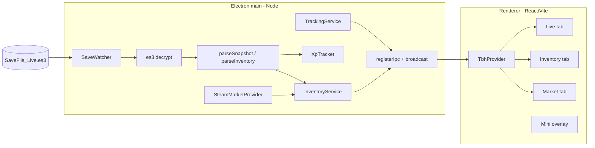

# Architecture

Single-language TypeScript app: an Electron desktop shell hosting a React/Vite
UI. All save-decryption and tracking logic lives in a framework-free `core/`
that is unit-tested independently.

## Processes

Entry bootstrap: `app/src/main/index.ts` (~25 lines) → `app/appState.ts` wires
`TrackingService`, `InventoryService`, and IPC handlers. Window paths live in
`main/paths.ts` only.

## Boundaries

- **main** owns all file system access, decryption, network (Steam), and the
  tracker state. It is the only place secrets/paths are touched.
- **preload** exposes a narrow, typed `window.tbh` API via `contextBridge`
  (channel names from `shared/ipc.ts`). No direct Node access leaks into the
  renderer.
- **renderer** is pure React UI. `TbhProvider` registers one IPC listener per
  channel; tabs consume `useStats` / `useInventory` / `usePrices`.
- **core** (`es3`, `save/snapshot`, `tracker`, `stages`, `heroes`, `gamedata`,
  `inventory/*`) has no Electron/React imports so it can be unit-tested with Vitest.

No local HTTP server: main ↔ renderer communicate over Electron IPC.

## Windows

Two `BrowserWindow`s load the same Vite bundle on different routes:

- **Full companion window** — resizable, tabbed (Live / Inventory / Market / Settings).
- **Mini overlay** (`/overlay`) — frameless, always-on-top, draggable, compact;
  toggled from the tab bar **Mini** button.

## Data flow (live stats)

1. `SaveWatcher` notices `SaveFile_Live.es3` mtime changed (poll interval from config).
2. Reads bytes (with a short retry for mid-write sharing violations).
3. `es3.decrypt` → `parseSnapshot` → `SaveSnapshot`.
4. `XpTracker.update(snap)` computes XP/gold/per-hero rates (positive deltas
   only, rates keyed on mtime, held constant between changes) and appends to
   history on change.
5. `TrackingService` pushes `Stats` over IPC; the renderer updates via `TbhProvider`.

## Data flow (inventory)

1. Same save read also runs `parseInventory` (with catalog-aware aggregate merge).
2. `InventoryService.resolveAndPushInventory` resolves rows against `GameDataProvider`
   + Steam price cache, then broadcasts `ResolvedInventory`.
3. Price refresh probes gear variant letters A–E on Steam when needed.

## Tests

Vitest layout mirrors source:

- `test/core/` — pure domain logic
- `test/main/` — config, paths, IPC helpers
- `test/ipc/` — channel parity
- `test/renderer/` — UI helpers
- `test/integration/` — optional local save (`realSave.test.ts`, skipped in CI)

Run `npm run qa` before merge (typecheck + tests + build + bundle guards).
