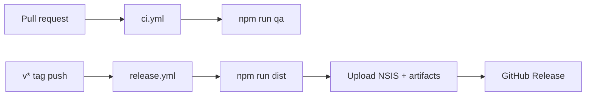

# GitHub Actions plan

CI/CD for TBH Companion. **Prerequisite:** merge PR #1 (`refactor/maintainability`) — it
lands `.github/workflows/qa.yml`, `npm run qa`, and the test layout.

## Current state (after refactor merge)

| Workflow | Trigger | What it does |
|----------|---------|--------------|
| `qa.yml` | `push` to `main` / `refactor/*`; `pull_request` touching `app/**` | Windows: `npm ci` → `npm run qa` → `npm audit --audit-level=high` (audit non-blocking) |

Gaps:

- No workflow runs on PRs that only touch docs, `.github/`, or `.cursor/` (unless `app/**` also changes).
- No release automation — `npm run dist` is manual only.
- No artifact upload or GitHub Release on version tags.

---

## Target architecture



---

## PR 1 — Expand CI (`ci.yml`)

**Branch:** `ci/github-actions` (this effort)  
**Goal:** Every PR to `main` gets a green QA gate before merge.

### Proposed changes

1. **Rename or supersede `qa.yml`** → `.github/workflows/ci.yml` (clearer name; delete old file in same PR).
2. **Triggers:**
   ```yaml
   on:
     pull_request:
       branches: [main]
     push:
       branches: [main]
   ```
   Drop path filters so doc-only PRs still run CI when they touch workflow files; keep path filter optional if minute costs matter:
   ```yaml
   paths:
     - "app/**"
     - ".github/workflows/**"
     - "data/**"
   ```
3. **Job:** single `qa` job on `windows-latest` (Electron app is Windows-first; matches dev environment in `AGENTS.md`).
4. **Steps:** checkout → setup-node 22 with npm cache → `npm ci` in `app/` → `npm run qa`.
5. **Audit:** keep `npm audit --audit-level=high` with `continue-on-error: true` until dependency baseline is clean; flip to blocking later.
6. **Concurrency:** cancel in-progress runs on new pushes to the same PR branch.

### Out of scope for CI job

- `npm run qa:dev` (starts Electron — flaky/headless on CI without extra setup).
- `realSave.test.ts` (already skipped when save file absent — fine on CI).

### Acceptance criteria

- [ ] PR to `main` shows required check `qa` (or `ci`).
- [ ] Failing test/typecheck/build blocks merge (branch protection when enabled).

---

## PR 2 — Release pipeline (`release.yml`)

**Goal:** Tag `v*` → build Windows installer → GitHub Release with assets.

### Trigger

```yaml
on:
  push:
    tags: ["v*"]
  workflow_dispatch:
    inputs:
      tag:
        description: "Tag to release (for manual run)"
        required: false
```

### Job: `release` (windows-latest)

| Step | Command / action |
|------|------------------|
| Checkout | `actions/checkout@v4` with `fetch-depth: 0` (optional, for changelog) |
| Node 22 | `actions/setup-node@v4` + cache |
| Install | `npm ci` in `app/` |
| QA gate | `npm run qa` (same bar as CI) |
| Build installer | `npm run dist` → `app/release/*.exe` (NSIS per `package.json`) |
| Upload artifact | `actions/upload-artifact@v4` — `app/release/**` |
| GitHub Release | `softprops/action-gh-release@v2` with `files: app/release/*` |

### Version sync

- Tag `v0.2.0` should match `app/package.json` `version` (enforce in workflow or document release checklist).
- Release notes: start with manual body from tag message; later auto-generate from commits.

### Secrets / signing (later)

| Item | Now | Later |
|------|-----|-------|
| `GITHUB_TOKEN` | Provided by Actions for releases | — |
| Windows code signing | Unsigned installer | `CSC_LINK` + `CSC_KEY_PASSWORD` |
| macOS / Linux builds | Not planned | Separate matrix jobs if needed |

### Acceptance criteria

- [ ] Push tag `v0.1.1` (or bump) produces a GitHub Release with NSIS installer attached.
- [ ] `npm run qa` passes in release job before `dist`.

---

## Branch & PR sequence

| Order | Branch | PR into | Contents |
|-------|--------|---------|----------|
| 0 | `refactor/maintainability` | `main` | **PR #1** — refactor (open) |
| 1 | `ci/github-actions` | `main` | This plan + implement `ci.yml` expansion |
| 2 | `ci/github-actions` (or `ci/release`) | `main` | Add `release.yml` + doc updates |

Recommended: **one branch `ci/github-actions`**, two commits (CI first, release second) or two PRs if you prefer smaller reviews.

---

## Repo settings (manual, post-merge)

1. **Branch protection** on `main`: require status check `qa` / `ci` before merge.
2. **Actions permissions:** allow workflows to create releases (Settings → Actions → General).
3. Optional: require PR reviews.

---

## Implementation checklist (agent-ready)

### CI PR

- [ ] Add/update `.github/workflows/ci.yml`
- [ ] Remove duplicate `qa.yml` if superseded
- [ ] Update `AGENTS.md` / README if workflow name changes
- [ ] Open PR; confirm check runs on the PR itself

### Release PR

- [ ] Add `.github/workflows/release.yml`
- [ ] Document tag + version bump in README or `docs/github-actions.md`
- [ ] Test with `workflow_dispatch` or test tag on fork
- [ ] Verify `docs/design/icons/concept-companion-512.png` path resolves in CI checkout

---

## References

- Existing gate: `app/scripts/qa-gate.mjs`, `npm run qa`
- Pack config: `app/package.json` → `build` / `nsis` / `win.icon`
- QA skill: `.cursor/skills/tbh-qa/SKILL.md`
